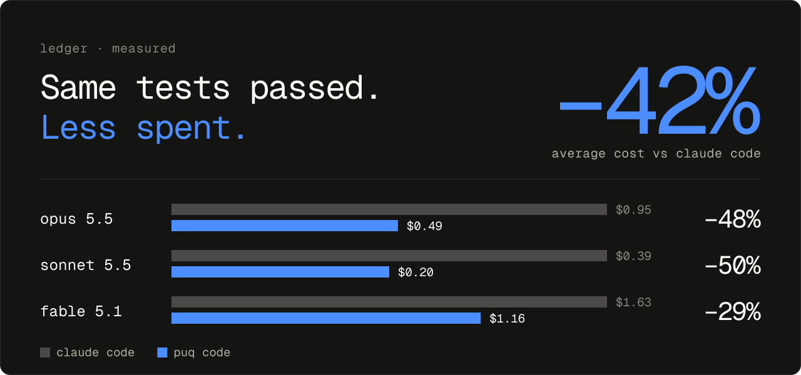
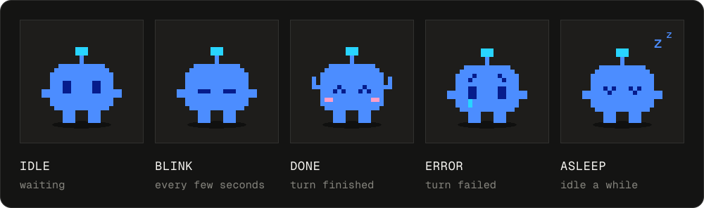

<h1 align="center">
  
  <br>
  puq code
</h1>

<p align="center">
  <b>A coding agent that lives in your terminal.</b><br>
  Same tests passed as Claude Code, <b>42% cheaper on average</b> on the same Claude subscription.
</p>

<p align="center">
  <a href="https://github.com/puq-ai/code/releases"></a>
  
  <a href="LICENSE"></a>
</p>

<p align="center">
  <a href="#install">Install</a> ·
  <a href="#42-cheaper-on-average">Savings</a> ·
  <a href="#what-puq-code-does">What it does</a> ·
  <a href="#meet-puqqy">Meet puqqy</a> ·
  <a href="#channels">Channels</a> ·
  <a href="#license-and-attribution">License</a>
</p>

---

## Install

```sh
curl -fsSL https://github.com/puq-ai/code/releases/download/channels/install.sh | sh
```

Then run `puq` inside any project. On first launch, sign in with your **puq** account
(`/login puq`, a puq.ai token) — `/model` then lists every tool-capable model puq serves.

| Platform | Architectures      |
| -------- | ------------------ |
| macOS    | arm64, x64         |
| Linux    | x64, arm64 (glibc) |

This repository holds the release binaries only; CI publishes them, there is no source code here.

## 42% cheaper on average

<p align="center">
  
</p>

| Model      | puq code | Claude Code | Saving   |
| ---------- | -------: | ----------: | -------: |
| Opus 5.5   |    $0.49 |       $0.95 |  **48%** |
| Sonnet 5.5 |    $0.20 |       $0.39 |  **50%** |
| Fable 5.1  |    $1.16 |       $1.63 |  **29%** |
| Average    |          |             |  **42%** |

## What puq code does

<table>
  <tr>
    <td width="50%" valign="top">
      <h3>Works in your codebase</h3>
      Reads, searches and edits files, runs shell commands, and talks to your language servers
      (LSP) for definitions, references and diagnostics.
    </td>
    <td width="50%" valign="top">
      <h3>Spends less per turn</h3>
      <b>42% cheaper on average</b> than Claude Code on the same subscription. A leaner prompt,
      ranked code-search hits and trimmed tool output; the status line can show each turn's cost.
    </td>
  </tr>
  <tr>
    <td valign="top">
      <h3>Extensible</h3>
      MCP servers, subagents for parallel work, web search, and Claude Code
      <code>settings.json</code> hooks work as-is.
    </td>
    <td valign="top">
      <h3>Safe to experiment</h3>
      File checkpoints with <code>/undo</code> and <code>/redo</code>, plus an OS-level sandbox
      for shell commands.
    </td>
  </tr>
  <tr>
    <td valign="top">
      <h3>Scriptable</h3>
      Structured output with <code>--output-schema</code> for CI, and
      <code>puq github install</code> to wire puq into a repository's workflows.
    </td>
    <td valign="top">
      <h3>Keeps itself current</h3>
      Checks its channel on launch and every 6 hours, verifies the SHA-256, and switches over
      on the next start. Or run <code>puq update</code>.
    </td>
  </tr>
</table>

## Meet puqqy


puqqy is puq code's pixel companion. It doesn't write code; it keeps you company while code gets
written. It hops onto the splash screen, then lives in the status line and takes every small win
and every stumble a little personally: a cheer when a turn finishes, a tear when one fails, a nap
when you've stepped away.

<p align="center">
  
</p>

It's off by default. Bring it in:

```sh
puq config set display.mascot on       # animated, with reactions
puq config set display.mascot static   # shown, no animation
```

or pick **Settings → Appearance → Mascot**.

## Channels

| Channel          | Install                                                                                 | Gets                                       |
| ---------------- | --------------------------------------------------------------------------------------- | ------------------------------------------ |
| stable (default) | `curl -fsSL https://github.com/puq-ai/code/releases/download/channels/install.sh \| sh` | versions that spent about a week on latest |
| latest           | `… \| sh -s -- latest`                                                                  | every release as it ships                  |

Switch an existing install: `puq config set update.channel latest` (or `stable`). Switching never
downgrades; you stay on your version until the channel passes it. GitHub's "Latest" badge marks
the current stable release.

<details>
<summary><b>Uninstall</b></summary>

```sh
rm ~/.local/bin/puq && rm -rf ~/.local/share/puq ~/.puq-code
```

This also deletes your settings and session history under `~/.puq-code`.

</details>

## License and attribution

puq code is released under the MIT license — see [LICENSE](LICENSE).

puq code is derived from [oh-my-pi](https://github.com/can1357/oh-my-pi) ("OMP"), which is also MIT-licensed.
`LICENSE` keeps OMP's original copyright lines (Mario Zechner; Can Bölük; Stencil Labs, Inc.) next to puq's. Third-party
components bundled into the binaries and their licenses are listed in
[THIRD-PARTY-NOTICES.txt](THIRD-PARTY-NOTICES.txt). Both files are also embedded in every binary: `puq --license`.

<p align="center"></p>
